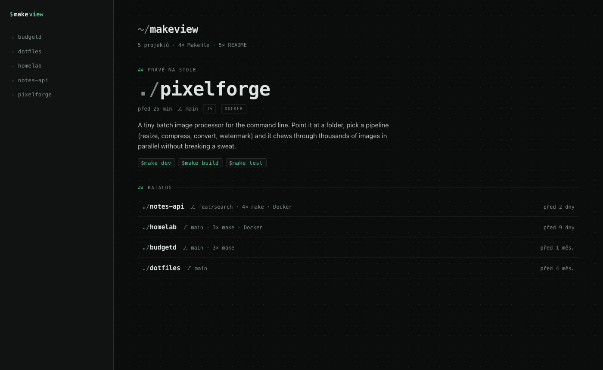
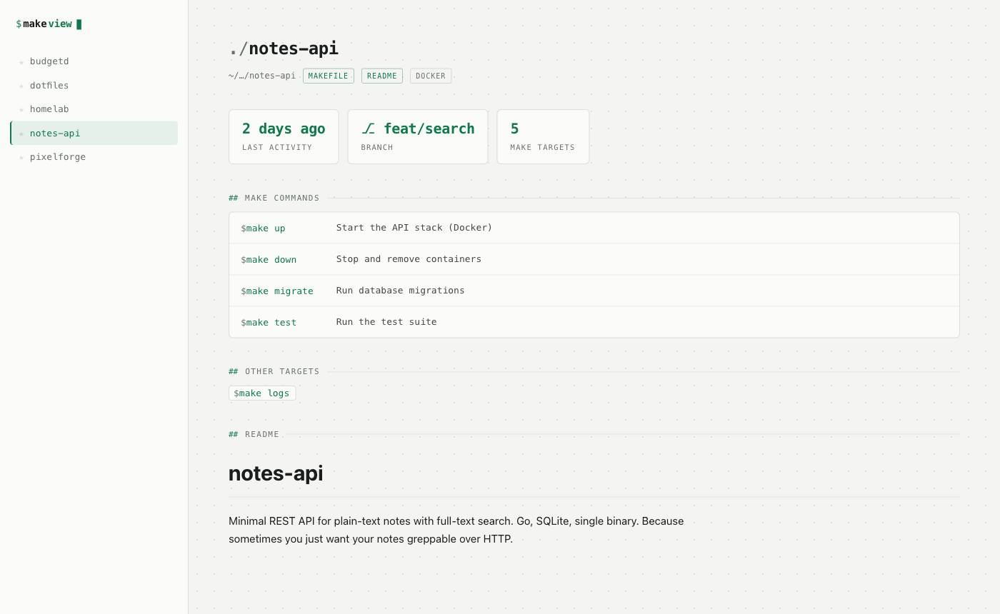

# Makeview

[](https://repometer.online/p/Resetnak/MakeView)

A single-file PHP dashboard for your local projects. It scans a directory of
projects, parses their **Makefile targets** (documented `target: ## desc` first),
shows **git branch + last activity** (read straight from `.git` files, no git
binary needed), and renders their **READMEs**. Click any `make` command to copy it.

> UI text is in Czech. No database, no framework, no build step — one PHP file
> plus [Parsedown](https://github.com/erusev/parsedown) for markdown.





## Install

### Docker (recommended)

```bash
git clone https://github.com/Resetnak/MakeView && cd MakeView
PERSONAL_DIR=~/projects docker compose up -d --build
# → http://localhost:8111
```

`PERSONAL_DIR` is the directory containing your projects (defaults to the
parent of the makeview checkout). It's mounted **read-only** — the app never
writes to your projects.

### Local PHP (no Docker)

Needs PHP 8.2+. Grab Parsedown once, then run the built-in server:

```bash
curl -fLo Parsedown.php https://raw.githubusercontent.com/erusev/parsedown/1.7.4/Parsedown.php
MAKEVIEW_DIR=~/projects php -S 127.0.0.1:8111 index.php
# → http://localhost:8111
```

`MAKEVIEW_DIR` points at your projects directory (defaults to `/projects`).

### Any PHP host

It's one file — drop `index.php` + `Parsedown.php` into any PHP 8.2+ webroot
and set the `MAKEVIEW_DIR` env var. Note the app is meant for **your own
machine**: it happily displays everything it finds, so don't point it at
private projects on a public server.

## How it works

- A project is any subdirectory of `MAKEVIEW_DIR` with a `Makefile` or `README.md`.
- Documented targets (`build: ## Compile the thing`) get descriptions; bare targets are listed too.
- Dashboard sorts projects by last git activity (`.git/index` mtime); pins are stored in `localStorage`.
- READMEs render through Parsedown in safe mode; project selection is whitelisted (no path traversal).

## License

MIT
